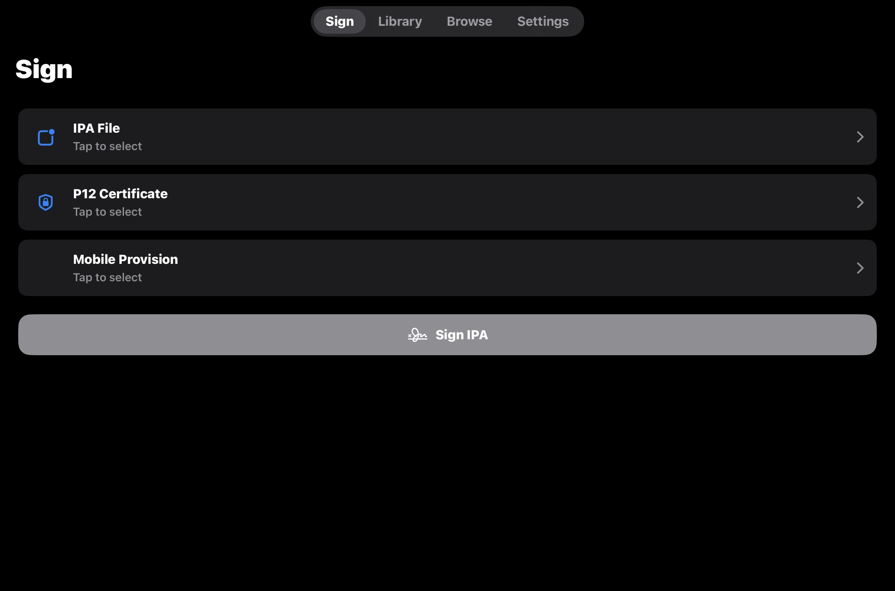
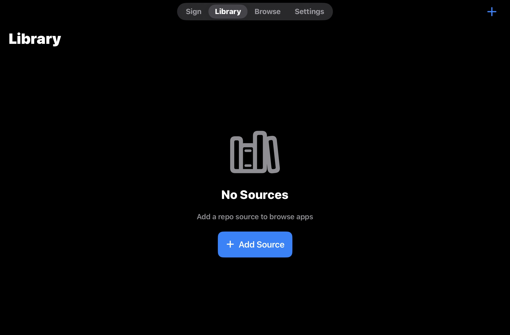
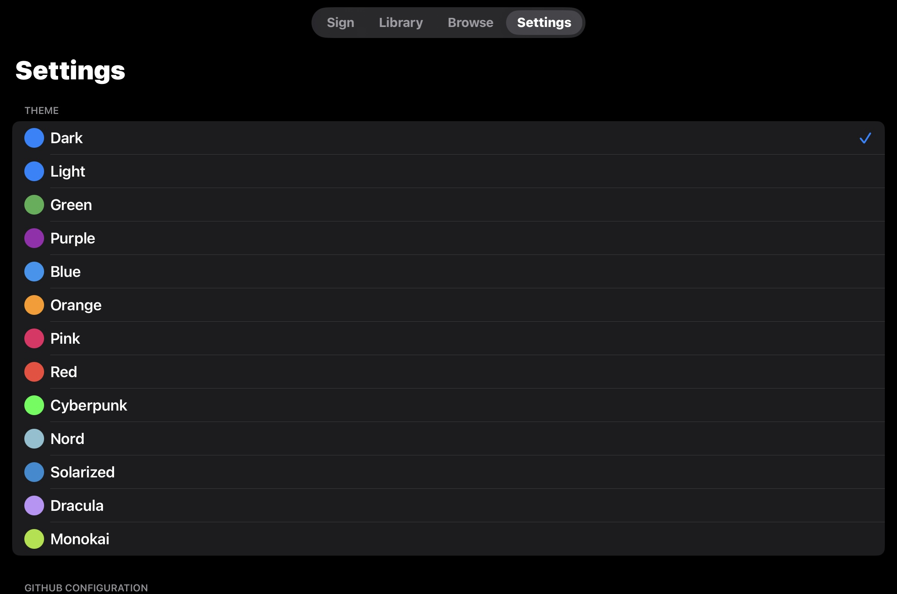

# CabbageSign

**CabbageSign is not a real working sideloading iOS app, simply it is just a template for those who want to create a sideloading app. Simply just fork the repo.**

## Disclaimer

**CabbageSign was not created using XCode, simply we used GitHub Actions for it to create an artifact that provided the .ipa file.**

## Previews
- iPadOS
  
  

- iOS
**soon**

*ps. not a real sideloading app.*

